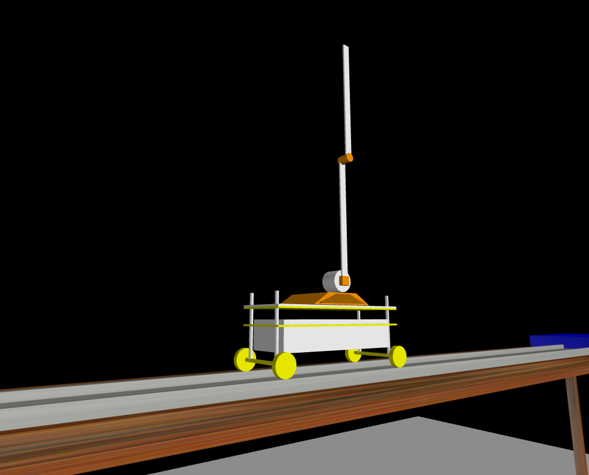
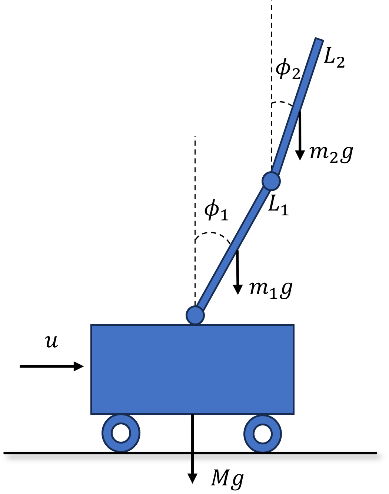
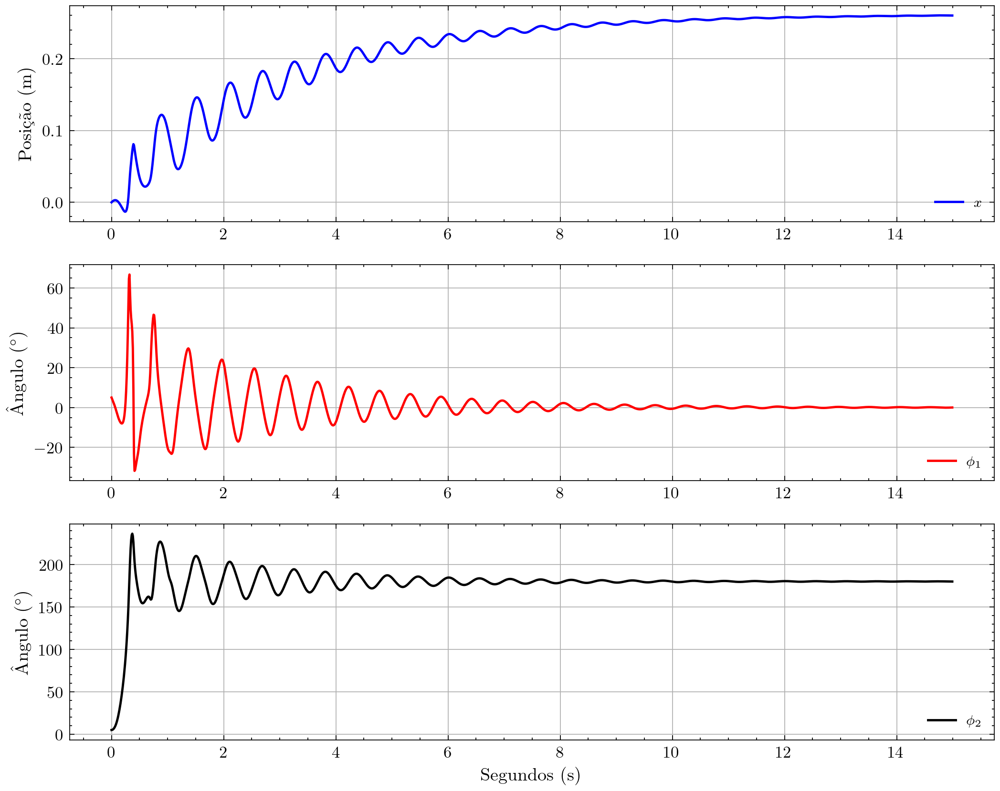

<p align="center">
  
</p>

<p align="center">
   
</p>

<p align="center">
    <a href="#Introdução"><strong>Introdução</strong></a>
  • <a href="#Modelagem"><strong>Modelagem</strong></a> 
  • <a href="#Controlador-LQR"><strong>Controlador LQR</strong></a>
  • <a href="#Filtro-de-Kalman"><strong>Filtro de Kalman</strong></a>
  • <a href="#Controlador-LQG"><strong>Controlador LQG</strong></a>
  • <a href="#Controlador-Preditivo"><strong>Controlador Preditivo (MPC)</strong></a>
</p>

<h3  id="techs">Tecnologias</h3>

<p align=center>     
  </ul>
  <br>
</p>

<h1 align=center>Trabalho de Conclusão de Curso [ Thalyson B B Silva ]</h1>

<p align=center> <i><strong>Tema: Controladores ótimos aplicados em um sistema com duplo pêndulo invertido dirigido por um carro.</strong></i></p>

```
.
├── docs
├── materiais_complementares
├── mkdocs.yml
├── README.md
├── revisao_tcc
├── softwares_duplopendulo
└── utils
```


## Introdução

O pêndulo invertido é um exemplo clássico de um sistema dinâmico instável. O objetivo desse projeto é simular este sistema e construir e implementar contraladores ótimos que estabilizem o pêndulo.

<p align="center">
  
</p>
<p align="center">
  
</p>

## Modelagem matemática

O modelo matemático dos pêndulos é derivado a partir das formulações de Lagrande. Assim, se obtém a equação a seguir.
$$
\begin{align} 
    \left\{\begin{matrix}
    \ddot{x}(M+m_1+m_2)- \ddot{\phi_1}l_1\cos(\phi_1) \left ( m_1+2m_2 \right) -\ddot{\phi_2}m_2l_2\cos(\phi_2) \nonumber \\ + \dot{\phi_1}^2l_1\sin(\phi_1) \left(m_1+2m_2\right )+\dot{\phi_2}^2m_2l_2\sin(\phi_2) =u-f_0 \dot{x} \\ \\ \ddot{\phi_1} \left (m_1l_1^2 + J_1 +2m_2l_1^2  \right )-\ddot{x} l_1\cos(\phi_1) \left (  m_1+2m_2 \right )   +2\ddot{\phi_2}m_2l_1l_2\cos(\phi_1-\phi_2) \nonumber \\ -2m_2l_1l_2\dot{\phi_2}^2\sin(\phi_2-\phi_1) +m_1gl_1\sin(\phi_1)+2gl_1m_2\sin(\phi_1) =-(f_1 + f_2)\dot{\phi_1} + f_2 \dot{\phi_2}  \\
    \\   -m_2\ddot{x}l_2\cos(\phi_2)+(2m_2l_2^2 + J_2)\ddot{\phi_2}+2m_2l_1l_2\ddot{\phi_1}\cos(\phi_2-\phi_1)  - 2\dot{\phi_1}^2 m_2 l_1 l_2\sin(\phi_2-\phi_1) \nonumber \\  - m_2gl_2\sin(\phi_2)   =f_2\dot{\phi_1} - f_2 \dot{\phi_2} \tag{1}
    \end{matrix}\right. 
\end{align} 
$$
Após linearizar o sistema, obtem-se o seguinte sistema em espaço de estados

$$
\begin{align}
\mathbf{A}=\begin{bmatrix}
0 &0  &0  &1  &0  &0 \\ 
 0& 0 &  0&  0&  1& 0\\ 
 0&  0&  0&  0&  0&1 \\ 
 0&  14,1743& -1,6437 & 0 &  0& 0\\ 
 0& -442,3352 &  147,6419& 0 &  0& 0\\ 
 0& 442,9258 & -344,3010 & 0 &  0&0 
\end{bmatrix},
\;\;\;
\mathbf{B}=\begin{bmatrix}
0\\ 
0\\ 
0\\ 
0.7781\\ 
-10.0133\\ 
3,3511
\end{bmatrix},\;\;
    \mathbf{C}= \begin{bmatrix}
1 &0  & 0 & 0 & 0 &0 \\ 
 0& 1 &  0& 0 &  0&0 \\ 
 0& 0&1  & 0 & 0 & 0\\ 
 0& 0& 0 & 0 & 0 & 0\\ 
 0& 0 & 0 & 0 & 0 & 0\\ 
 0&0  & 0 & 0 & 0 &0 
\end{bmatrix}
\end{align}
$$
### Análise de Malha Aberta
Resposta inicial do sistema para as seguintes condições inicais:
$x_0 = [0, 0, 0.1,0,0,0]$
<p align="center">
  
</p>
O sistema apresenta um comportamento oscilatório dos estados observados ao longo do tempo, por conta dessa caracteristica, o sistema é considerado instável.

## Controlador LQR


## Filtro de Kalman


## Controlador LQG


## Controlador Preditivo (MPC

